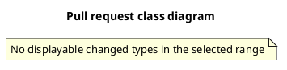

# Pull Request 差分クラス図

`umlgen diff` は、Git リビジョン間で変更された Java／Go の型とその周辺だけを切り出し、編集可能な PlantUML クラス図を生成します。追加された型は緑、変更された型は黄、削除された型は赤で表示されるため、レビュー時の設計影響範囲を素早く把握できます。

実際の出力例は [`examples/order-service/README.md`](../examples/order-service/README.md) を参照してください。

## 導入方法

### GitHub Actions（おすすめ）

再利用可能なワークフローを呼び出すと、Pull Request ごとに `change-diagram.puml` と `change-diagram.svg` を Actions artifact として保存できます。ソースコードを外部サービスに送信しません。

利用リポジトリに `.github/workflows/umlgen-diff.yml` を作成します。

```yaml
name: UML diff

on:
  pull_request:

permissions:
  contents: read

jobs:
  umlgen-diff:
    permissions:
      contents: read
    uses: Mino829/umlgen/.github/workflows/umlgen-pr-diff.yml@main
    with:
      source: src/main/java
```

導入直後の試用では `@main` を利用できます。本運用では、umlgen のリリースタグまたは完全な commit SHA へ固定することを推奨します。

実行後、Actions の run summary から `umlgen-pr-diff` artifact をダウンロードします。内容は次の 2 ファイルです。

```text
change-diagram.puml
change-diagram.svg
```

ワークフローの入力・出力・セキュリティに関する詳細は [`docs/github-actions.md`](./github-actions.md) を参照してください。

### ローカル CLI

[README のインストール手順](../README.md#インストール)に従って `umlgen` をインストールします。

```bash
# 直前のコミットとの差分
umlgen diff HEAD~1

# main ブランチとの PR 差分（merge-base を使用）
umlgen diff main...HEAD

# 2 点指定（main の直後から HEAD まで）
umlgen diff main..HEAD

# SVG も同時に生成（ローカルに PlantUML が必要）
umlgen diff main...HEAD --format svg
```

デフォルトの出力先は `change-diagram.puml` です。

## 使い方

### リビジョンの指定

`umlgen diff <revision-or-range>` として、Git でサポートされている形式をそのまま利用できます。

| 指定例 | 意味 |
| --- | --- |
| `HEAD~1` | 1 つ前のコミットと現在の HEAD を比較 |
| `main...HEAD` | `main` と `HEAD` の merge-base から `HEAD` までの差分。PR 差分に最も近い |
| `main..HEAD` | `main` から `HEAD` までの差分。merge-base 以降に main 側で追加されたコミットも含む |
| `<commit>` | 指定コミットと作業ツリーの比較 |

### 周辺型の表示

`--depth` で、変更された型から何段先の関係まで図に含めるか指定できます。デフォルトは `1` です。

```bash
# 変更型のみ
umlgen diff main...HEAD --depth 0

# 2 段先まで
umlgen diff main...HEAD --depth 2
```

`--direction` で関係の探索方向を選べます。

```bash
# 変更型が依存する型だけ（下流）
umlgen diff main...HEAD --direction out

# 変更型に依存する型だけ（上流）
umlgen diff main...HEAD --direction in

# 双方向（デフォルト）
umlgen diff main...HEAD --direction both
```

### 色の意味

| 色 | 意味 |
| --- | --- |
| 緑 (`#palegreen`) | 追加された型 |
| 黄 (`#lightyellow`) | 変更された型 |
| 赤 (`#lightcoral`) | 削除された型 |

無色の型は、変更型の周辺（`--depth` 内）に含まれた未変更の型です。

### その他の主なオプション

`class` コマンドと同じフラグが利用できます。

```bash
umlgen diff main...HEAD \
  src/main/java \
  --output docs/change-diagram.puml \
  --format svg \
  --show-relation-labels \
  --relations inheritance,implementation,field \
  --title "PR class diagram"
```

`.umlgen.yaml` の `exclude` 設定も有効です。ただし、変更ファイルが `exclude` で除外されると、表示可能な変更型がなくなり「変更なし」相当のプレースホルダ図が生成されます。

## 精度・検出ルール

`umlgen diff` は Git の差分情報と AST 解析結果を組み合わせて図を生成します。その特性と限界を正しく理解して利用してください。

### 変更検出はファイル単位

`git diff --name-status --find-renames` でファイルごとの変更ステータスを取得し、以下のように扱います。

| Git ステータス | 扱い | 色 |
| --- | --- | --- |
| `A`（追加） | 追加 | 緑 |
| `M` / `T`（変更 / ファイル種別変更） | 変更 | 黄 |
| `R` / `C`（リネーム / コピー） | 変更 | 黄 |
| `D`（削除） | 削除 | 赤 |
| 未追跡ファイル | 追加 | 緑 |

**重要**: 変更判定は**ファイル単位**です。1 つの Java ファイルに複数の型が含まれていたり、メソッド本体だけが変更されていたりしても、そのファイル内の**すべての型が変更色で表示されます**。型単位やメソッド単位の差分検出は行いません。

### 削除されたファイルは Git 履歴から復元

削除された `.java` / `.go` ファイルは、base リビジョンの内容を `git show` で読み込んで解析し、赤で図に含めます。これにより、「PR 前に存在していた型が何を持っていたか」を図で確認できます。

### 周辺型の選定は関係グラフに基づく

`--depth` で指定した範囲は、変更型を起点にした関係グラフの BFS 距離です。関係の種類は継承、実装、フィールド型、引数型、戻り値型から構成されます。したがって、**メソッド本体内部の呼び出しや Spring の DI など、宣言に現れない依存は周辺型に含まれません**。

### 関係は宣言ベース

図に出る関係は以下に限定されます。

- 継承 (`extends`)
- 実装 (`implements`)
- フィールド型
- メソッド／コンストラクタの引数型
- メソッドの戻り値型

メソッド内部で呼び出している型、ローカル変数の型、リフレクションで動的に解決する型は関係に現れません。PR で「呼ぶだけ」になった型は、図上では追加／変更されても関係線が引かれないことがあります。

### 表示可能な変更型がない場合

`diff` モードでは、変更があっても型を抽出できないとき、エラーではなく「変更なし」相当のプレースホルダ図を生成して終了コード `0` を返します。

- 変更が `package-info.java` など型を含まないファイルだけ
- 変更型が `exclude` 設定で除外された結果、変更型が見つからない

プレースホルダ図の例:



変更されたファイルを解析できず、表示可能な変更型がない場合は終了コード`3`になります。`--exclude` の結果として対象ファイルが0件になる場合は、その手前で`no Java files found`エラー（終了コード`1`）になります。`diff`対象に`.java` / `.go`ファイルがそもそも存在しない場合も同様です。GitHub ActionsワークフローはJavaファイルの変更がないケースを事前に検知し、別のプレースホルダ図を生成します。

### 再利用ワークフローは Java 変更を検知

`.github/workflows/umlgen-pr-diff.yml` は `.java` ファイルの変更を検知します。Go プロジェクトでは「Java 変更なし」として処理されるため、Go プロジェクトで利用する場合はローカル CLI を使うか、独自のワークフローで `umlgen diff` を呼び出してください。

### クラス図本体の限界が継承される

`umlgen diff` の精度は、あくまで `umlgen class` の解析精度の範囲内です。したがって、以下は diff 図でも同様に扱われません。

- Lombok などが生成するメンバー
- リフレクションで解決する型
- プロジェクト外（外部ライブラリ）の未解決型との関係
- 匿名クラス、ローカルクラス、enum 定数固有の class body
- generic 型パラメータと境界の完全な型解析
- sealed 型の `permits` 一覧からの関係推論

詳細は [README の「現在の解析範囲」](../README.md#現在の解析範囲)を参照してください。

## トラブルシューティング

### 変更があるのに「変更なし」になる

- `source` / 対象パスが正しいか確認してください。特に Actions ではリポジトリ相対パスです。
- 変更が `.umlgen.yaml` の `exclude` 対象になっていないか確認してください。
- 再利用ワークフローは `.java` の変更のみを検知します。Go ファイルの変更は検知されません。

### 型が含まれていないファイルだけ変更された場合

`package-info.java` など型を含まないファイルだけが変更された場合、上述のプレースホルダ図が生成されます。umlgen v0.5.0 未満を使っている場合は、このケースで終了コード `1` となり CI が失敗する可能性があります。この挙動は、v0.5.0 以降で解消されています。

### 図に想定外の型が多く出る

`--depth` のデフォルトは `1` です。変更型の直接関係先が多い場合は図が大きくなります。`--depth 0` か、`--direction out` / `in` で方向を絞ってください。

### base / head が取得できない

Actions では `pull_request` イベントから呼び出すのが最も確実です。別のイベントから呼ぶ場合は、`base-sha` と `head-sha` を明示してください。

### セキュリティ

- ワークフローは `pull_request` イベントと `contents: read` だけを使用します
- Fork Pull Request では read-only の `GITHUB_TOKEN` で動作し、secret を要求しません
- `pull_request_target` は使用しません
- ソースコードは PlantUML Server へ送信されず、GitHub-hosted runner 内の PlantUML CLI で SVG を生成します
