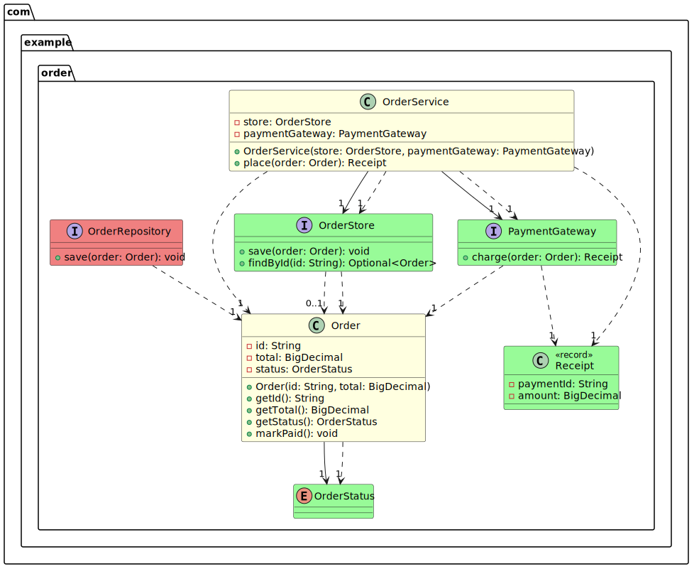
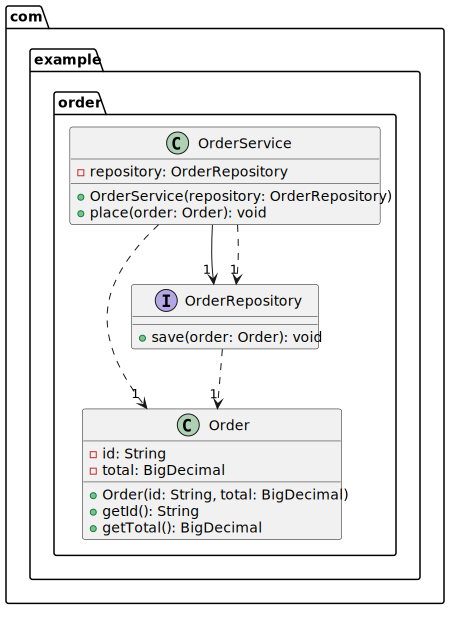
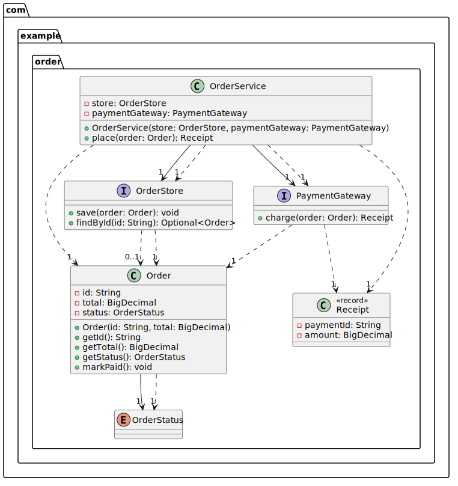
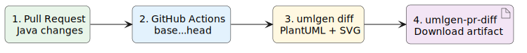

# 30秒で分かるumlgen PR差分図

注文処理へ決済機能を追加するPull Requestを想定したデモです。

変更された`Order`と`OrderService`は黄色、新しい決済関連の型は緑、置き換えられた`OrderRepository`は赤で表示されます。コードをすべて追わなくても、設計上の影響範囲をすぐ確認できます。



## Before／After

| Before | After |
| --- | --- |
| 決済処理を持たない注文サービス | 決済GatewayとReceiptを追加 |
|  |  |

図の編集可能なPlantUMLソースも[`assets`](assets/)に含まれています。

## Pull Requestでの流れ



Actionsのrun summaryにある`umlgen-pr-diff` artifactをダウンロードすると、`change-diagram.puml`と`change-diagram.svg`を取得できます。

## 自分のリポジトリで試す

`.github/workflows/umlgen-diff.yml`を作成します。

```yaml
name: UML diff

on:
  pull_request:

permissions:
  contents: read

jobs:
  umlgen-diff:
    permissions:
      contents: read
    uses: Mino829/umlgen/.github/workflows/umlgen-pr-diff.yml@main
    with:
      source: src/main/java
```

本運用では`@main`ではなく、リリースタグまたは完全なcommit SHAへの固定を推奨します。入力項目とFork Pull Requestの注意事項は[GitHub Actions導入ガイド](../../docs/github-actions.md)を参照してください。

## ローカルでデモを再生成する

Go版umlgenとPlantUMLをインストールしてから実行します。

```bash
go install github.com/Mino829/umlgen/cmd/umlgen@latest

# macOS
brew install plantuml

./examples/order-service/generate.sh
```

スクリプトは`scenarios/before`と`scenarios/after`から一時Gitリポジトリを作り、Before／After／DiffのPlantUMLとSVGを`assets`へ生成します。元のソースやGit履歴は変更しません。

導入を任せたい場合は、最初の10リポジトリを対象とした[無料導入サポート](../../docs/onboarding-support.md)を利用できます。
